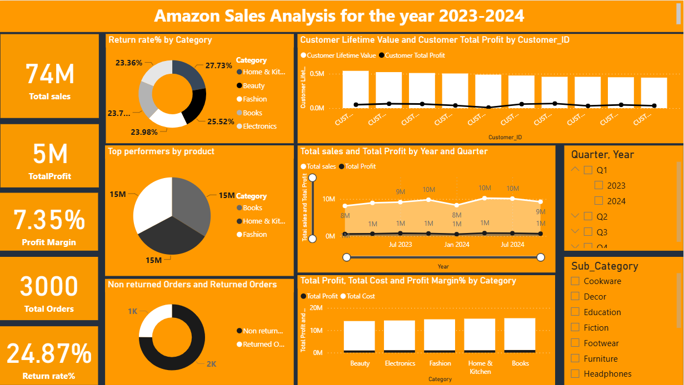

Power BI dashboard analyzing Amazon sales performance (2023–2024)
# Amazon Sales Analysis (2023–2024) | Power BI

## 🔎 Project Summary
Developed an interactive Power BI dashboard to analyze Amazon sales performance for the years 2023–2024.  
The project focuses on identifying revenue drivers, profitability trends, customer lifetime value, and return behavior to support data-driven business decisions.

## 🎯 Business Objectives
- Analyze overall sales and profit performance
- Identify high-revenue but low-profit categories
- Evaluate customer lifetime value and contribution to profit
- Measure the impact of product returns on profitability
- Track quarterly and yearly sales trends

## 📊 Key Performance Indicators (KPIs)
- **Total Sales:** 74M  
- **Total Profit:** 5M  
- **Profit Margin:** 7.35%  
- **Total Orders:** 3,000  
- **Return Rate:** 24.87%

  ## 📈 Key Insights & Analysis
- Certain categories generate strong revenue but suffer from **high return rates**, negatively impacting margins
- **Customer Lifetime Value (CLV)** varies significantly across customers, highlighting key high-value segments
- Profitability shows **seasonal trends** across quarters
- Returned orders account for nearly **one-fourth of total orders**, indicating improvement opportunities in product quality or logistics
- Books and Fashion emerge as consistent top-performing categories by sales volume

  ## 🛠 Technical Implementation
- **Power BI** for data modeling, visualization, and dashboard development
- **DAX** for calculated measures including:
  - Total Sales
  - Total Profit
  - Profit Margin %
  - Return Rate %
  - Customer Lifetime Value
- **Excel** for data cleaning, transformation, and preprocessing

## 📌 Dashboard Features
- KPI cards for quick executive-level insights
- Category-wise return rate analysis
- Customer Lifetime Value vs Total Profit comparison
- Quarterly and yearly sales & profit trend analysis
- Interactive slicers for Year, Quarter, Category, and Sub-Category
  

## 📂 Files Included
- Power BI report (.pbix)
- Dataset
- Dashboard Image

- ## 👤 Author
**Rhydam Kumar**  
Aspiring Data Analyst | Power BI | SQL | Excel | Data Visualization  

📌 *This project is part of my data analytics portfolio and demonstrates practical business analytics using Power BI.*
-
